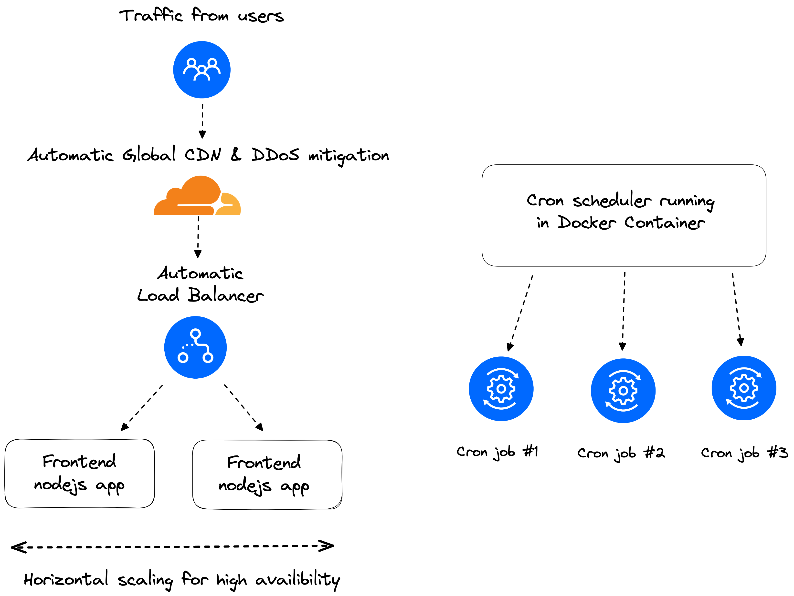

**As an alternative DigitalOcean Functions natively supports scheduling functions.**

For more information, please refer to the [How to Schedule Functions guide](https://docs.digitalocean.com/products/functions/how-to/schedule-functions). To schedule DigitalOcean Functions, you can create a function trigger and configure a schedule using standard cron syntax.

<!-- PROJECT LOGO -->
<br />
<div align="center">
  <a href="https://digitalocean.com/">
    
  </a>

<h3 align="center">DigitalOcean | App Platform Cron Worker</h3>

  <p align="center">
    App Platform allows you to Build, deploy, and scale apps quickly using a simple, fully-managed infrastructure solution.
    <br>This tutorial shows you how to <b>run scheduled jobs on App Platform using a Cron Worker.</b>
    <br />
    <a href="https://docs.digitalocean.com/developer-center/app-platform/"><strong>Explore more App Platform tutorials in the DigitalOcean Developer Center»</strong></a>
    <br />
    <a href="https://www.digitalocean.com/product-tours/app-platform"><strong>Quick App Platform tour»</strong></a>
  
  </p>
</div>

## Introduction

In this tutorial, we'll guide you through the process of setting up a job scheduler in App Platform using a docker container that runs cron as an App Platform [Worker](https://docs.digitalocean.com/products/app-platform/how-to/manage-workers/).

## Architecture diagram



## Prerequisites

1. A DigitalOcean account ([Log in](https://cloud.digitalocean.com/login))
2. doctl CLI([tutorial](https://docs.digitalocean.com/reference/doctl/how-to/install/))

# Deploy to App Platform

Click the following button to deploy the app to App Platform. If you are not currently logged in with your DigitalOcean account, this button prompts you to to log in.

[](https://cloud.digitalocean.com/apps/new?repo=https://github.com/DO-Solutions/docker-cron/tree/main)

## Steps

1. Fork this [docker-cron](https://github.com/DO-Solutions/docker-cron) repo

Use `doctl` to retrieve your existing apps App Spec and add docker-cron.

2. Retrieve App ID

`doctl apps list`

3. Use that ID to retrieve your apps App Spec

`doctl apps spec get b6af73dc-8aba-4237-8dc9-b632ad379bd5 > appspec.yaml`

```yaml
alerts:
- rule: DEPLOYMENT_FAILED
- rule: DOMAIN_FAILED
name: walrus-app
region: nyc
services:
- environment_slug: node-js
  git:
    branch: main
    repo_clone_url: https://github.com/digitalocean/sample-nodejs.git
  http_port: 8080
  instance_count: 1
  instance_size_slug: basic-xxs
  name: sample-nodejs
  routes:
  - path: /
  run_command: yarn start
  source_dir: /
  ```
  
4. Add the Docker-cron worker

```yaml
alerts:
- rule: DEPLOYMENT_FAILED
- rule: DOMAIN_FAILED
name: walrus-app
region: nyc
services:
- environment_slug: node-js
  git:
    branch: main
    repo_clone_url: https://github.com/digitalocean/sample-nodejs.git
  http_port: 8080
  instance_count: 1
  instance_size_slug: basic-xxs
  name: sample-nodejs
  routes:
  - path: /
  run_command: yarn start
  source_dir: /
workers:
- dockerfile_path: Dockerfile
  github:
    branch: main
    deploy_on_push: true
    repo: <your-github-username>/docker-cron
  instance_count: 1
  instance_size_slug: basic-xxs
  name: docker-cron
  source_dir: /
  ```
  
5. Update your app to deploy Docker-cron Worker
 
`doctl apps update b6af73dc-8aba-4237-8dc9-b632ad379bd5 --spec appspec.yaml`

# Verify worker functionality
We can use `doctl` to retrieve our runtime logs and verify our cron is running, by default it will output to console

`doctl apps logs b6af73dc-8aba-4237-8dc9-b632ad379bd5 --type=run`

# Contact

Jack Pearce, Solutions Engineer - jpearce@digitalocean.com

<p align="right">(<a href="#top">back to top</a>)</p>
