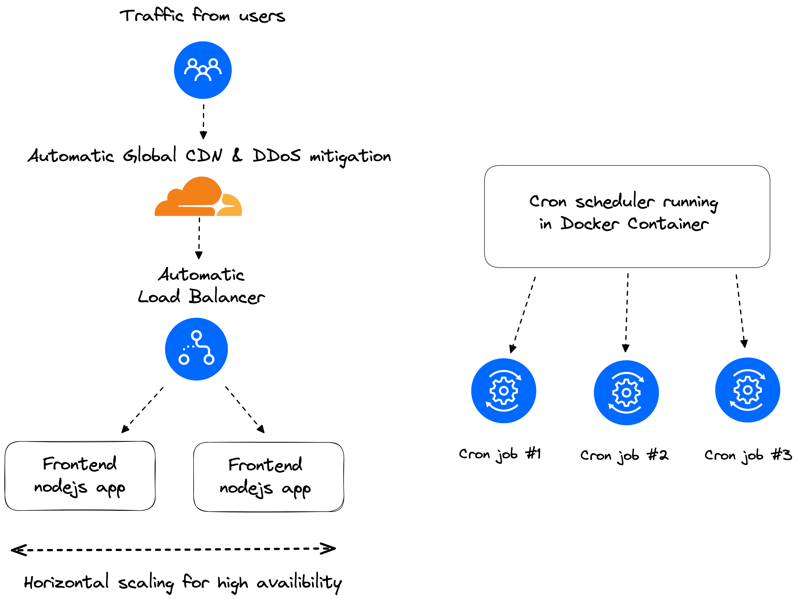

# DigitalOcean-AppPlatform-Cron
<!-- <div id="top"></div> -->
<!--
*** Thanks for checking out the Best-README-Template. If you have a suggestion
*** that would make this better, please fork the repo and create a pull request
*** or simply open an issue with the tag "enhancement".
*** Don't forget to give the project a star!
*** Thanks again! Now go create something AMAZING! :D
-->


<!-- PROJECT LOGO -->
<br />
<div align="center">
  <a href="https://digitalocean.com/">
    
  </a>

<h3 align="center">DigitalOcean | App Platform Cron </h3>

  <p align="center">
    App Platform allows you to Build, deploy, and scale apps quickly using a simple, fully-managed infrastructure solution.
    <br>This tutorial shows you how to <b>run scheduled jobs on App Platform using cron.</b>
    <br />
    <a href="https://docs.digitalocean.com/tutorials/app-platform/"><strong>Explore more App Platform tutorials»</strong></a>
    <br />
    <a href="https://www.digitalocean.com/product-tours/app-platform"><strong>Quick App Platform tour»</strong></a>
  
  </p>
</div>

# Getting Started


## Architecture diagram


## Introduction

In this tutorial, we'll guide you through the process of setting up a job scheduler in App Platform using a docker container that runs cron. We'll talk you through the steps required to build the docker container in case you want to modify it and deploy the scheduler as an App Platform Worker using the smallest/cheapest container size. Setting up your own scheduled jobs is as easy as modifying the included `crontab` file.


## Prerequisites

1. A DigitalOcean account ([Log in](https://cloud.digitalocean.com/login))
2. A Cloudflare account
3. doctl CLI([tutorial](https://docs.digitalocean.com/reference/doctl/how-to/install/))

# Quick / Easy version

1. Fork this [docker-cron](https://github.com/jkpedo/docker-cron) repo
2. Add the following to your App Spec (yaml):

```yaml
workers:
- dockerfile_path: Dockerfile
  github:
    branch: main
    deploy_on_push: true
    repo: jkpedo/docker-cron
  instance_count: 1
  instance_size_slug: professional-xs
  name: docker-cron
  source_dir: /
```

3. Modify `crontab` in the forked repo to add your own cron jobs.

# Hard / detailed version

## Environmental setup

# 1. Git - Create a new repo for Docker cron worker

First create a new Git repo on Github or Gitlab that we can deploy our Docker cron worker from

## Create `Dockerfile`

```Dockerfile
FROM ubuntu

RUN apt-get update \
    && DEBIAN_FRONTEND=noninteractive apt-get -y --no-install-recommends install -y cron curl \
    # Remove package lists for smaller image sizes
    && rm -rf /var/lib/apt/lists/* \
    && which cron \
    && rm -rf /etc/cron.*/*

COPY crontab /hello-cron
COPY entrypoint.sh /entrypoint.sh

RUN crontab hello-cron
RUN chmod +x entrypoint.sh

ENTRYPOINT ["/entrypoint.sh"]

# https://manpages.ubuntu.com/manpages/trusty/man8/cron.8.html
# -f | Stay in foreground mode, don't daemonize.
# -L loglevel | Tell  cron  what to log about jobs (errors are logged regardless of this value) as the sum of the following values:
CMD ["cron","-f", "-L", "2"]

## Deploy a public-facing nginx service

To deploy the service, follow these steps:

```sh
cd doks-example/

# Setup the datacenter env to lon1 for London-based cluster
export DC=lon1

# Build an new image that including lon1 text in the header
./script/docker-publish $DC

# Create a DOKS cluster at London datacenter and deploy service
./script/up $DC
```
Wait until a new window pops up. You should see a landing page similar to the following,


Repeat the same process to create a Sydney-based cluster by setting the environment variable DC to syd1:
```sh
# Setup the datacenter env to lon1 for London-based cluster
export DC=syd1

# Build an new image that including lon1 text in the header
./script/docker-publish $DC

# Create a DOKS cluster at London datacenter and deploy service
./script/up $DC

```
Wait until a new window pops up. You should see a landing page similar to the following,


# 2. Cloudflare: Setup Global Load Balancer
## Add site to Cloudflare
To create a new Cloudflare site, follow these steps:

1. Add a site to work with. For this tutorial, we will use `isfusion.cloud` as the domain.

2. Add a host entry. You can add any random entry that will not be used.

3. Use a root domain name instead of a subdomain

4. To begin, select the "Add Site" link located in the top right corner of the page.


## Turn on load-balancing

Go to the Traffic section in the menu and choose "Load Balancing"


The wizard will ask you to choose a subscription if you don't already have one. We suggest picking the cheapest option, which is enough for this tutorial as we only need two servers to show what Cloudflare can do. The subscription will also ask you how many regions should check the health of your servers and if you want to turn on dynamic traffic management for faster response times and geographic routing.


Upon completion of the previous step, you will be directed to this page.


Click the "Create Laod Balancer"

## Setting a hostname 

We are going to put together our endpoints and health checks to make a load balancer. We will use Cloudflare's servers as a full proxy, so all web traffic will go through them. This is the default option. Another option is just to redirect the traffic with DNS, but this won't let us use the full benefits of these platforms, like caching and keeping web traffic secure. This example will use `doks-multi-regions-cluster.isfusion.cloud` as the hostname.


## Create an Origin Pool

The first step in using Cloudflare is to decide where you want the traffic to go. This can be any group of computers that can receive traffic from the internet. The more spread out these computers are, the better it is to use a service like Cloudflare to control the traffic.

To use Kubernetes clusters as origins, they must be set up to receive traffic from the internet by having a service with an external IP address. This can be done by using a Load Balancer service or a tool called an ingress controller like NGINX. To find the IP address to use for a service, you can use the following command:

```sh
# Get all context first 
$ kubectl config get-contexts 
$ kubectl config use-contexts do-lon1-doks-lon1-multi-region-cluster
$ kubectl get services doks-example
NAME           TYPE           CLUSTER-IP     EXTERNAL-IP      PORT(S)        AGE
doks-example   LoadBalancer   10.245.70.99   138.68.118.154   80:31010/TCP   28h
```


## Create monitor and add notification
We need to make sure the nodes in our pool are working properly. We do this by checking their health on a regular schedule. If a node fails the check, it will be marked as not working and will not receive any traffic until it passes the check again. Sometimes nodes stop working because of upgrades or other problems. For this example, we will check if the NGINX program on each cloud is showing its default page. For more complicated situations, it's a good idea to have a special page that tests the connection to all the data sources and makes sure everything is working correctly. If we don't do this, the load balancer might think the program is still working when it's actually not.


## Traffic sterring
In this example, when we make the pool, we are using weighting to control the incoming traffic. We have two groups of computers, one in London and one in Sydney. Both groups will get the same amount of traffic (50%).


## Custom rule(optional)
This step is optional. You can choose to set up your own rules for how the traffic is spread around the world, or you can just click "Next" and skip it.


## Review & deploy
When you have finished setting everything up, you can make your first multi-regional DOKS cluster with traffic control around the world by clicking the "Save and Deploy" button.


## Multi-regions cluster is ready!
Now you will see a new load balancer on the screen with a healthy status and other settings.


# 3. Verify The Global Load Balancing

You can verify the randomly distributed incoming traffic between London and Sydney datacenters (with a 50/50 weighting) by running some simple commands.

```sh
./verify.sh
```
You will see the following information displayed in your terminal.

```sh
<title>Welcome to DOKS @ lon1</title>
<title>Welcome to DOKS @ syd1</title>
<title>Welcome to DOKS @ lon1</title>
<title>Welcome to DOKS @ syd1</title>
<title>Welcome to DOKS @ lon1</title>
<title>Welcome to DOKS @ syd1</title>
<title>Welcome to DOKS @ syd1</title>
<title>Welcome to DOKS @ lon1</title>
<title>Welcome to DOKS @ syd1</title>
<title>Welcome to DOKS @ lon1</title>
```

# 4. Turn down everything
```sh
cd doks-example
export DC=lon1
# Select yes when you get a prompt
./script/down $DC

export DC=syd1
# Select yes when you get a prompt
./script/down $DC
```
<!-- # 5. Cost analysis -->
<!-- # Common error message and how to troubleshooting

- doctl, docker, kubectl
- container registry
- svc crashed loop
- pull images but always crash
(使用alwaypullimage policy)
(刪除registry上的檔案重新push或是用新的tagging)
-  -->

<p align="right">(<a href="#top">back to top</a>)</p>


<!-- USAGE EXAMPLES -->


<!-- CONTRIBUTING -->
<!-- ## Contributing -->
<!--  -->
<!-- <!-- <!-- <!-- Contributions are what make the open source community such an amazing place to learn, inspire, and create. Any contributions you make are **greatly appreciated**. --> 
<!--  -->
<!-- <!-- <!-- <!-- If you have a suggestion that would make this better, please fork the repo and create a pull request. You can also simply open an issue with the tag "enhancement". -->
<!-- <!-- Don't forget to give the project a star! Thanks again! --> 
<!--  -->
<!-- 1. Fork the Project -->
<!-- <!-- 2. Create your Feature Branch (`git checkout -b feature/AmazingFeature`) --> 
<!-- <!-- 3. Commit your Changes (`git commit -m 'Add some AmazingFeature'`) --> 
<!-- <!-- 4. Push to the Branch (`git push origin feature/AmazingFeature`) --> 
<!-- 5. Open a Pull Request -->
<!--  -->
<!-- <!-- <p align="right">(<a href="#top">back to top</a>)</p> --> 


<!-- LICENSE -->
<!-- ## License -->

<!-- Distributed under the MIT License. See `LICENSE.txt` for more information. -->

<!-- <p align="right">(<a href="#top">back to top</a>)</p> -->


<!-- CONTACT -->
# Contact

Jeff Fan - jfan@digitalocean.com

<p align="right">(<a href="#top">back to top</a>)</p>


<!-- ACKNOWLEDGMENTS -->
<!-- ## Acknowledgments -->
<!--  -->
<!-- * []() -->
<!-- * []() -->
<!-- * []() -->
<!--  -->
<!-- <p align="right">(<a href="#top">back to top</a>)</p> -->


<!-- MARKDOWN LINKS & IMAGES -->
<!-- https://www.markdownguide.org/basic-syntax/#reference-style-links -->
[contributors-shield]: https://img.shields.io/github/contributors/github_username/repo_name.svg?style=for-the-badge
[contributors-url]: https://github.com/github_username/repo_name/graphs/contributors
[forks-shield]: https://img.shields.io/github/forks/github_username/repo_name.svg?style=for-the-badge
[forks-url]: https://github.com/github_username/repo_name/network/members
[stars-shield]: https://img.shields.io/github/stars/github_username/repo_name.svg?style=for-the-badge
[stars-url]: https://github.com/github_username/repo_name/stargazers
[issues-shield]: https://img.shields.io/github/issues/github_username/repo_name.svg?style=for-the-badge
[issues-url]: https://github.com/github_username/repo_name/issues
[license-shield]: https://img.shields.io/github/license/github_username/repo_name.svg?style=for-the-badge
[license-url]: https://github.com/github_username/repo_name/blob/master/LICENSE.txt
[linkedin-shield]: https://img.shields.io/badge/-LinkedIn-black.svg?style=for-the-badge&logo=linkedin&colorB=555
[linkedin-url]: https://linkedin.com/in/linkedin_username
[product-screenshot]: images/screenshot.png
